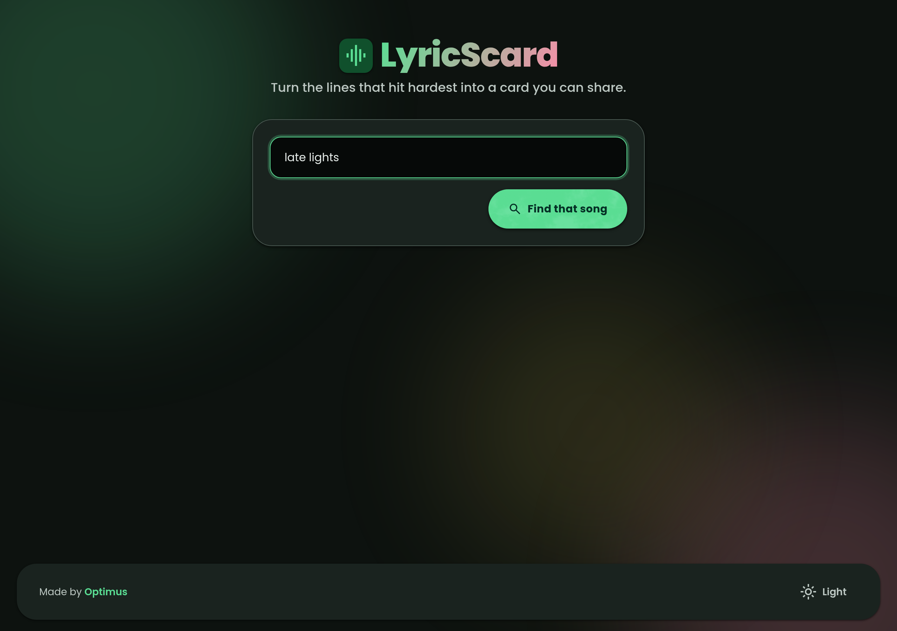
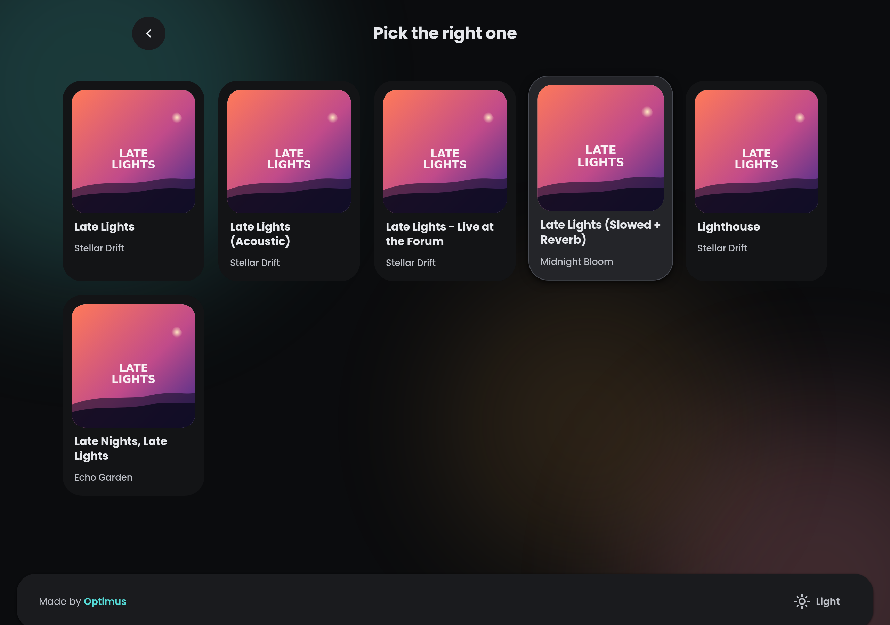
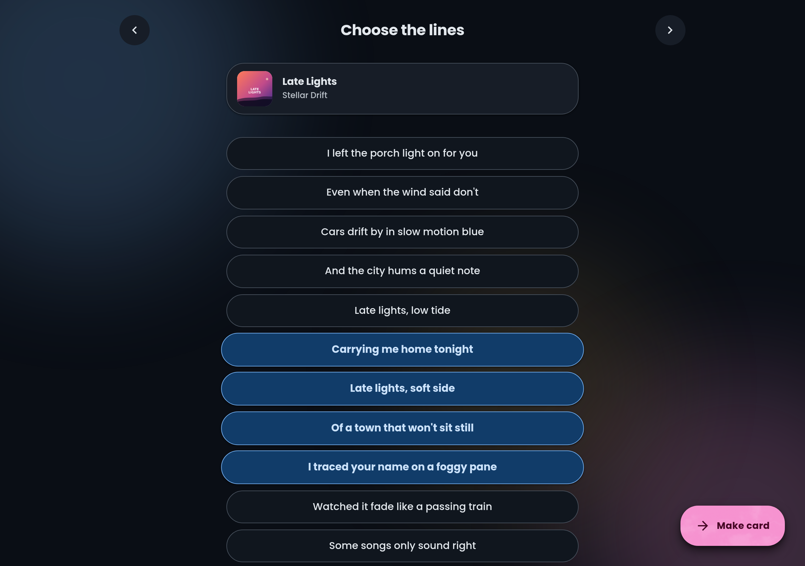
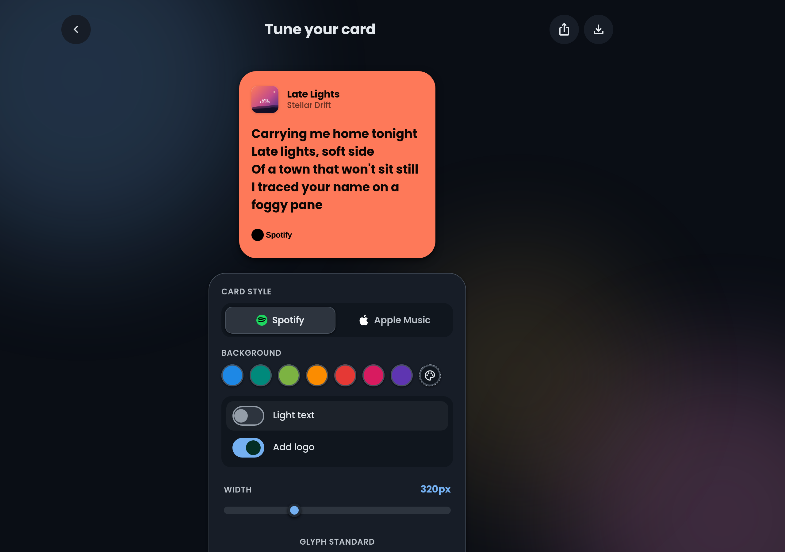
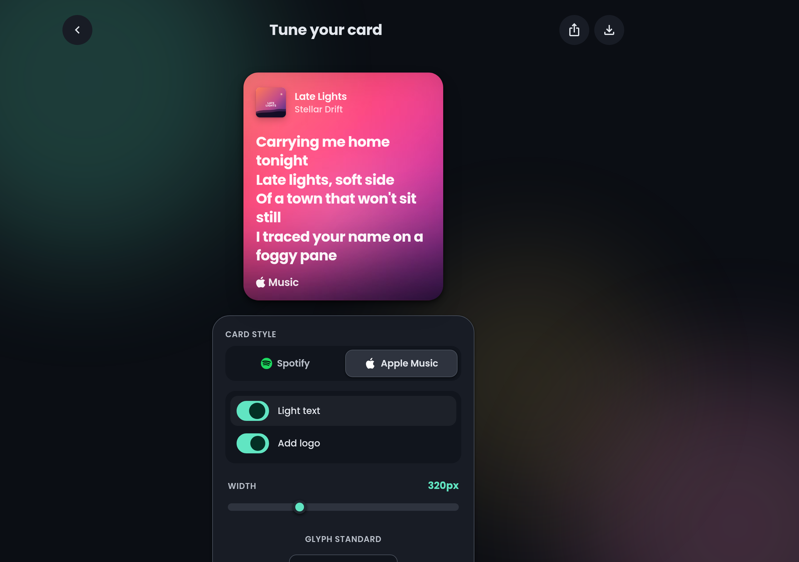
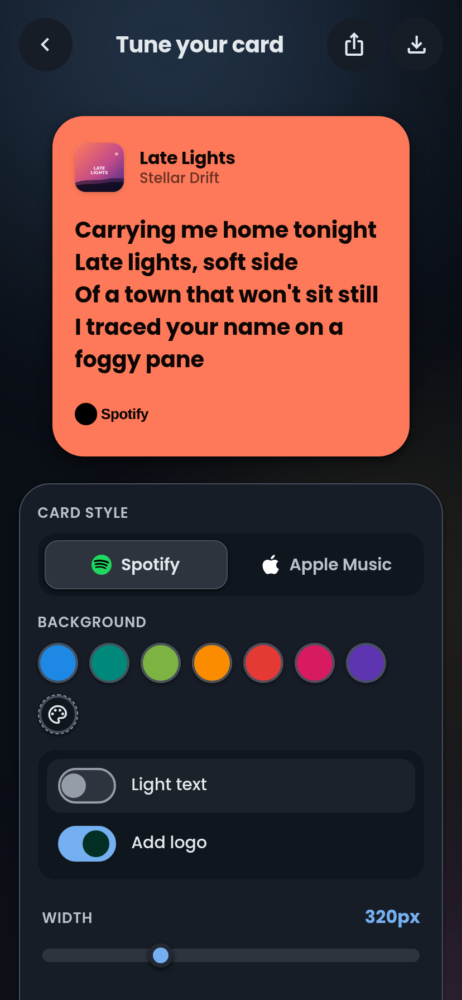
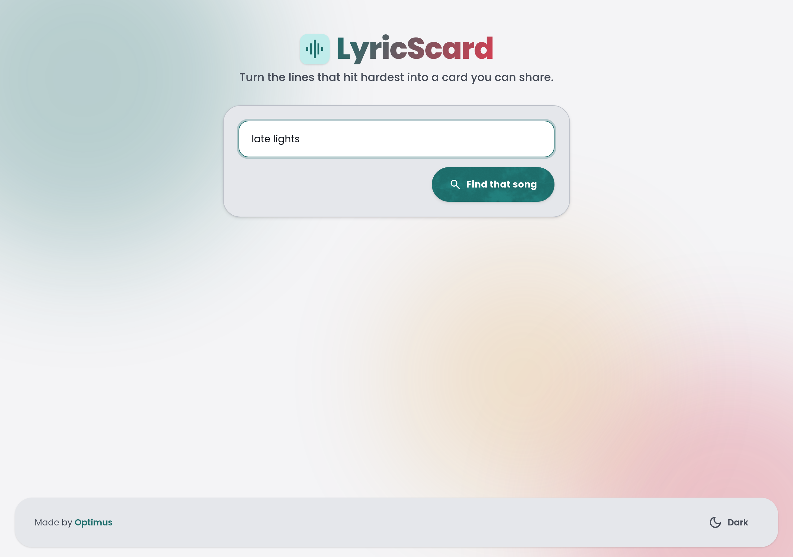

# LyricScard

> Turn the lines that hit hardest into a card you can share.

Search a song, pick the lyrics that wreck you, and walk away with a Spotify- or Apple-Music-style card you can drop into a story, a tweet, or a group chat. Vanilla JS on the front, a thin Node + Vercel backend on the back, [Last.fm](https://www.last.fm/) for song metadata, and [lrclib](https://lrclib.net/docs) (with a couple of fallbacks) for lyrics.

<p align="center">
  
</p>

## The 60-second tour

Search → pick the right track → highlight the lines that matter → tune the card.

<table>
  <tr>
    <td width="50%"></td>
    <td width="50%"></td>
  </tr>
  <tr>
    <td align="center"><sub>Pick the right one — usually it's the first hit.</sub></td>
    <td align="center"><sub>Tap the lines you want. The FAB shows up when you've got at least one.</sub></td>
  </tr>
</table>

Then it's all sliders and toggles until the card looks the way you want, and the download button hands you a high-res PNG.

<table>
  <tr>
    <td width="50%"></td>
    <td width="50%"></td>
  </tr>
  <tr>
    <td align="center"><sub>Spotify style — the original.</sub></td>
    <td align="center"><sub>Apple Music style — uses the album art as a blurred background.</sub></td>
  </tr>
</table>

It runs on phones too — the controls collapse into a single column and the card stays the centerpiece:

<p align="center">
  
</p>

Light mode is right there in the footer if you'd rather:

<p align="center">
  
</p>

## What's new

A few things that landed recently and are worth calling out:

- **Apple Music card style.** A second card layout that uses the album cover as a blurred background — looks especially good on photo-driven covers.
- **9-second search countdown.** Lyric lookups race three providers in parallel ([lrclib](https://lrclib.net/docs), StefDP, PaxSenix) with a hard 9s budget. The countdown ticks down on screen so you know the app didn't stall.
- **Android search-results scroll fix.** Long song titles no longer push the results card off the side of the screen.
- **Footer pinned to viewport bottom.** On long screens it sits at the bottom; on short ones it hugs the content. Used to do neither well.
- **API keys moved server-side.** Last.fm key lives in `LASTFM_API_KEY` on the server; nothing sensitive ships to the browser.
- **Material 3 Expressive redesign.** New color tokens, glassmorphic surfaces, real elevation, light + dark palettes that swap cleanly.

## Run it locally

You need **Node 18+** and the [Vercel CLI](https://vercel.com/docs/cli):

```bash
npm i -g vercel
cp .env.example .env.local        # then paste your LASTFM_API_KEY
vercel dev
```

`vercel dev` serves the static files at <http://localhost:3000> and runs each `api/*.js` handler as a serverless function.

> No Last.fm key? Grab one in 60 seconds at <https://www.last.fm/api/account/create>.

## Deploy

```bash
vercel              # first time: link or create the project
vercel --prod       # ship it
```

Then in the Vercel dashboard: **Project → Settings → Environment Variables → add `LASTFM_API_KEY`**.

## What's under the hood

```
api/
  search.js          PaxSenix → Last.fm fallback, returns a normalized song list
  lyrics.js          races PaxSenix + StefDP + lrclib, returns the first valid hit
classes/
  data/              Artist, Lyric, Song models
  DataFetcher.js     thin client for /api/*
  DOMHandler.js      the wizard — screen routing, line selection, card rendering
  NoiseButton.js     the subtle grain overlay on primary buttons
styles/              main.css (tokens + shell), wizard.css, song-image.css
index.html           single-page app
index.js             wires fetcher + handler
vercel.json          function config + headers
```

Cards render in the DOM (no canvas hacks) and get exported via [html2canvas](https://html2canvas.hertzen.com/) at 2× scale. Album art and brand wordmarks are pre-tinted on a canvas so html2canvas doesn't have to. The dominant card color is sampled from the cover by scoring pixels on saturation × mid-lightness, with a curated random palette as a fallback.

Lyric lookups use `Promise.any` across providers so the first one to return wins; the others are aborted. If everything 404s, the UI says so instead of spinning forever.

## Disclaimer

Not affiliated with or endorsed by Spotify or Apple Music. Wordmarks are used per their respective branding guidelines and fetched at runtime; nothing about the cards themselves implies endorsement.

## License

MIT — see [LICENSE](LICENSE).
